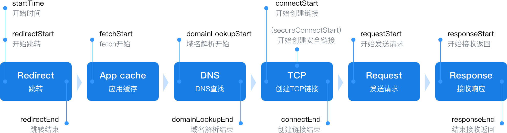
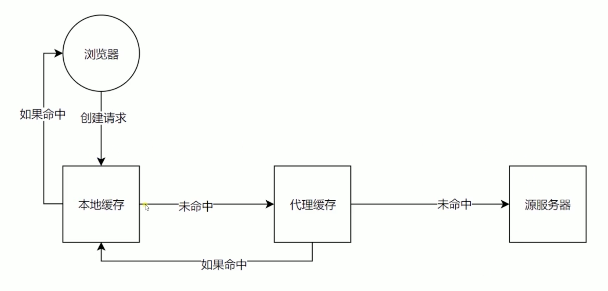

# HTTP协议原理+实践

## 经典五层模型
* 应用层 `为应用软件提供服务` `HTTP、FTP...`
* 传输层 `向用户提供可靠的端到端(End-to-End)服务` `TCP、UDP`
* 物理层 `主要作用是定义物理设备如何传输数据` `硬件设备`
* 数据链路层 `通讯实体间建立数据链路链接` `二进制传输`
* 网络层 `数据在节点之间传输创建逻辑链路` `访问服务器逻辑`

## HTTP协议发展历史
### HTTP / 0.9
* 只有一个命令GET
* 没有HEADER等描述数据的信息
* 服务器发送完毕，就关闭TCP链接 `TCP 链接对应多个 HTTP 请求`
### HTTP / 1.0
* 增加很多命令 `GET POST`
* 增加 status code header
* 多字符集支持、多部分发送、权限、缓存等
### HTTP / 1.1
* 持久链接
* pipeline
* 增加host和其他一些命令
* 数据发送接收方式是串行
### HTTP / 2.0
* 所有数据以二进制传输
* 同一个链接里发送多个请求不在按照顺序来
* 数据发送接收方式是并行
* 头信息压缩以及推送 `服务端主动推送` 等提高效率的功能

## HTTP 三次握手时序图
规避网络延迟造成的影响
* 所有数据以二进制传输
* 同一个链接里发送多个请求不在按照顺序来
* 数据发送接收方式是并行
* 头信息压缩以及推送 `服务端主动推送` 等提高效率的功能

## URI URL URN
* URI `统一资源标志符` `用来唯一标识互联网上的信息资源` `包括 URL URN`
* URL `统一资源定位器` `http://chatroom.qah5.wjrmt.cn/chat?bar_id=bar7ba8c088a&bar_uid=407ac248040800f5f22ee068492e3358144d082f&app_id=12&activity_id=1638`
* URN `永久统一资源定位符` `在资源移动后还能被找到` `目前没有成熟使用方案`

## HTTP 报文格式
`curl -v http://www.baidu.com`

## HTTP 访问网页整个过程

## CORS跨域请求的限制与解决 
* 服务器 
  * 同源限制 `'Access-Control-Allow-Origin': '*'`
  * 自定义 Headers `'Access-Control-Allow-Headers': 'X-Test-Cors'`
  * 预请求 OPTIONS `'Access-Control-Allow-Methods': 'POST, PUT, DELECT'`
  * 预请求时间内不加载预请求 `'Access-Control-Max-Age': '1000'`
* JSONP ``

## 缓存验证

### 验证头
* Last-Modified 